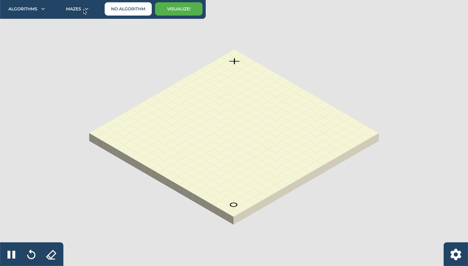

# Path Finding and Maze Generation Visualization  

## Overview
This is a web app written primarilly javascript with HTML5 and CSS to visualize path finding and maze generation algorithms. 

**LIVE LINK:** [http://path-finding-visualization.meizayaga.com](http://path.meizayaga.com)

The path finding algorithms currently available are:  
* Uni-directional Djikstra's
* Bi-directional Djikstra's
* Uni-directional A* Search
* Bi-directional A* Search
* Breadth First Search
* Depth First Search
* Greedy Best First Search

The maze generation algorithms are:
* Recursive Division
* Depth First Search
* Krusal's
* Prim's
* Random Walls (high, medium, low density)
* Stair Pattern

This project should be viewed on a desktop or laptop computer.

 

**Placing and removing walls**  
Just click and drag anywhere on the board, same goes for removing a wall. 

 

**Moving starting and ending point**  
Click and hold on the start or end and move it to the desired spot.

 

**Choosing a path finding algorithm**  
Go to the algorithm drop down at the top and pick your desired algorithm, then click VISUALIZE!.  

**Move start/end after completing algorithm**  
You can move the start and end blocks after you have completed a path-finding algorithm to see how it would behave in different environments.

 

**Choosing a maze generation algorithm**  
Go to the maze dropdown menu on the top and then click the maze algorithm of your choice.

 

**Change the program's settings**  
Go to the gear icon at the bottom right of the screen and change a variety of settings like amount of rows and columns, size, rendering and speed.

