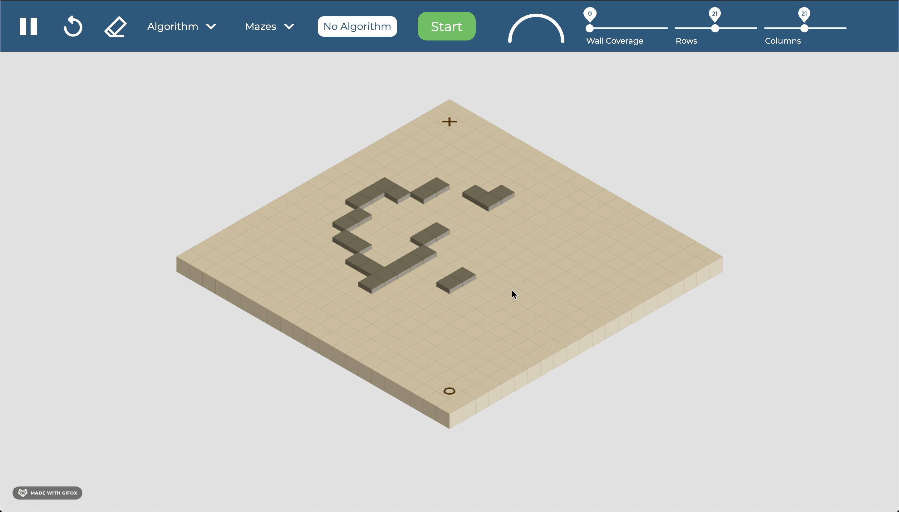
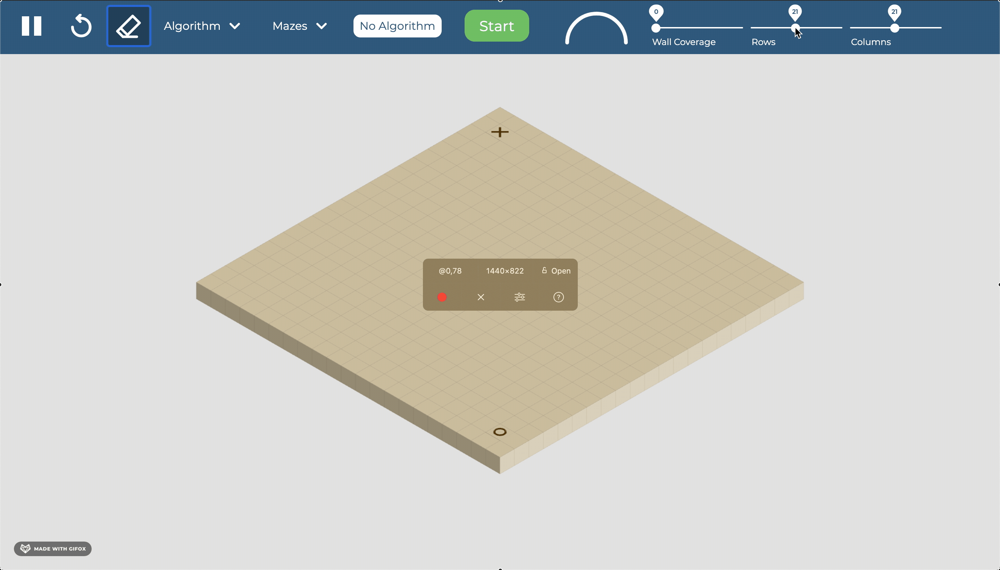
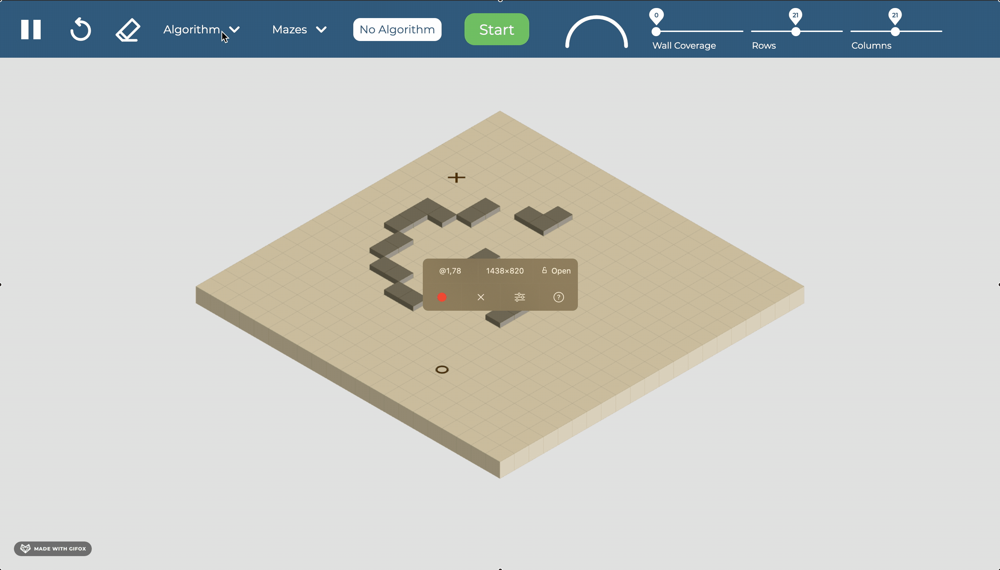
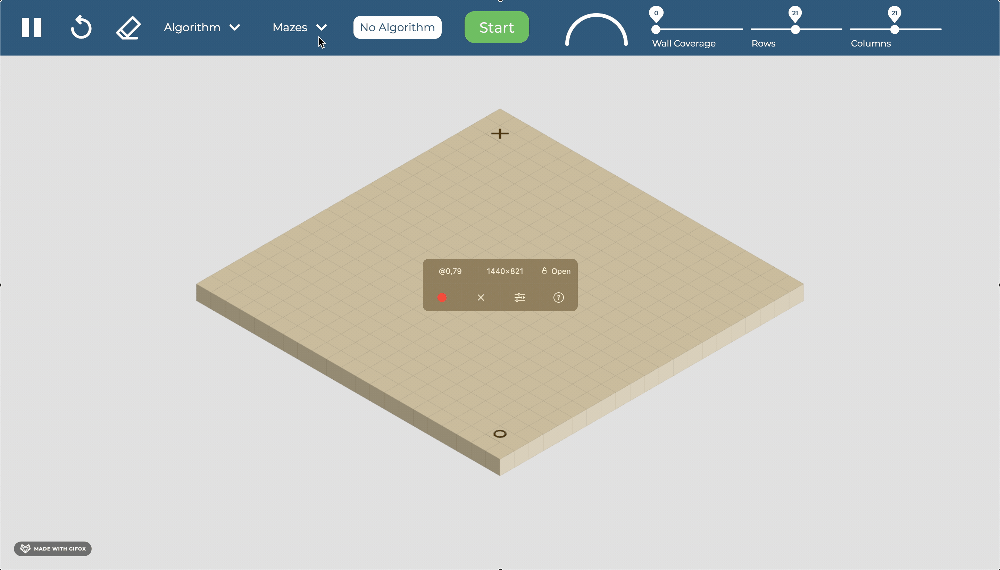
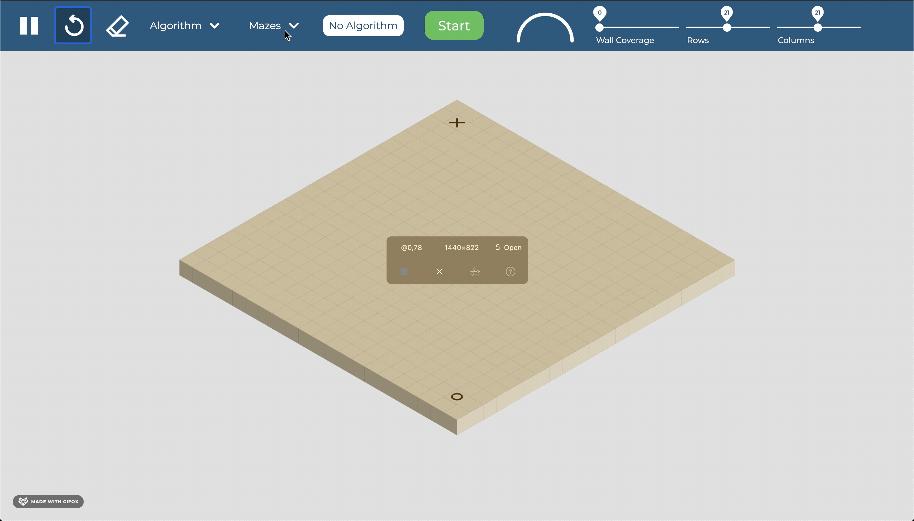
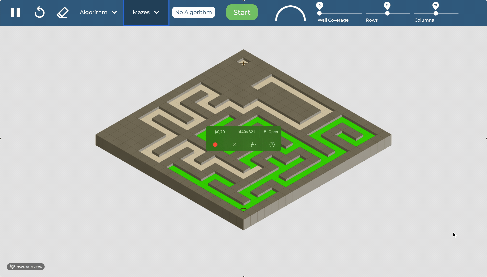

# Path Finding and Maze Generation Visualization

## Overview
This is a web app written in javascript with the [p5.js](http://p5js.org) library to visualize path finding and maze generation algorithms. 

**LIVE LINK:** [Path Finding Visualization](http://path.meizayaga.com/)

The path finding algorithms currently available are:  
* Djikstra's
* A*
* Greedy BFS
* DFS
* BFS
* Djikstra Bidirectional
* A* Bidirectional

The maze generation algorithms are:
* Recursive Division
* Depth First Search
* Prim's
* Krusal's

This project should be viewed on a desktop or laptop computer.

 

**Placing and removing walls**  
Just click and drag anywhere on the board, same goes for removing a wall. 

 

**Moving starting and ending point**  
Click and hold on the start or end and move it to the desired spot.

 

**Resizing the board**  
Go to the sliders in the top right and slide to your desired number of blocks.

 

**Choosing a path finding algorithm**  
Go to the algorithm drop down at the top and pick your desired algorithm, then click start. 

**DISCLAIMER**  
The progress bar on the top is JUST for visual purposes, it does not accurately measure how much long until completion. 

 

**Choosing a maze generation algorithm**  
Go to the maze dropdown menu on the top and then click the algorithm of your choice.

